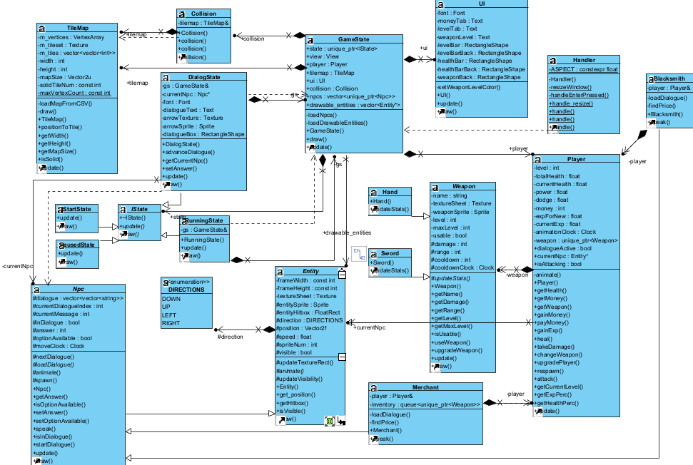

# Survivops 🎮

[](https://github.com/flaventu/survivops/actions/workflows/ci.yml)

[](https://www.sfml-dev.org/)

## Purpose 🥅

This is a project for the "[Fundamentals of computer graphics](https://corsi.unige.it/off.f/2024/ins/77856)" course offered by the Bachelor's degree in [Computer Science](https://corsi.unige.it/corsi/8759) at the [University of Genoa](https://unige.it/).

## Description ▶️

It is a simple low-level 2D single-player game where you can explore the world map, interact with NPCs, fight enemies, develop your character's skills and weapons.

## Why SurvivOps ❔

The title is a play on the words "survive" and "Ops", just like [Dev-Ops](https://azure.microsoft.com/it-it/resources/cloud-computing-dictionary/what-is-devops). The idea is to take the main pivots of the model, where you **build** your application, **test** it and finally **deploy** it multiple times to associate it to the functions of the game;

- 🔧 build: you can purchase or upgrade your weapons and improve your character's abilities.
- 🧪 test: there is a training area where you can simulate fight.
- ✈️ deploy: where you can finally fight real enemies and take on new challenges as you progress throught the game.

It's a run-based game, which means that instead of following a linear story, the game substantially never ends, allowing the player great freedom in their gameplay.

## Constraint 🛑

1. the project must start from **scratch** (i can only use the [cmake-sfml-project](https://github.com/SFML/cmake-sfml-project) template).
2. I cannot use **external libraries** except for [SFML](https://www.sfml-dev.org/) itself.
3. I'm limited to using only **basic primitives** (text, simple shapes, sprite and vertex array).

## Credits 🌟

- 👥 **Characters (Player, Npcs and Enemies)**:
  - [retro-rpg-character-pack](https://the-pixel-nook.itch.io/retro-rpg-character-pack) by *The Pixel Nook*
- 🗡️ **Weapons**:
  - [super-epic-fantasy-weapons-pack](https://babysamurai.itch.io/super-epic-fantasy-weapons-pack) by *Babysamurai*
- ➡️ **UI arrow**:
  - [caz-pixel-letters](https://cazwolf.itch.io/caz-pixel-letters) by *Caz*

## Current Class Diagram 🔠



## Requirements ✒️

- [](https://cmake.org/)
  - **≥ 3.28**
- 
  - **17**
    - GCC ≥ 9 or Clang (Linux)
    - Apple Clang (macOS)
    - MSVC (Visual Studio 2022+) or MinGW (Windows)
- 
  - Needed to clone the project and download SFML via `FetchContent`
- 
  - Automatically downloaded and built using [`FetchContent`](https://cmake.org/cmake/help/latest/module/FetchContent.html)

## Setup ⚙️

After cloning the project with Git, follow the setup instructions below depending on your operating system or development environment:

### 🐧 Linux / macOS

```bash
# Run these commands inside the project root

# Create and enter the build directory
mkdir build && cd build

# Generate build files with CMake
cmake ..

# Compile the project
cmake --build .

# Navigate to the output directory
cd bin

# Run the game
./SurvivOps
```

### 🪟 Windows

#### Visual Studio

1. Open **Visual Studio 2022** (or newer).
2. Click on “**Open a local folder**” and select the project root directory.
3. Visual Studio will automatically detect the `CMakeLists.txt` file and configure the project.
4. Press **F5** or click “**Start Debugging**” to build and run the game.

#### Terminal (PowerShell or CMD)

```powershell
# Run these commands inside the project root

# Create a build directory
mkdir build
cd build

# Configure (Visual Studio generator)
cmake .. -G "Visual Studio 17 2022"

# Build (Release config)
cmake --build . --config Release

# Navigate to the output directory
cd bin/Release

# Run the executable
./SurvivOps.exe
```

### 🧩 Visual Studio Code (Cross-platform)

You can easily configure, build, and run the project in Visual Studio Code using the [**CMake Tools**](https://code.visualstudio.com/docs/cpp/cmake-linux) extension.

1. After installing the extension, open the project folder in VS Code
2. Press `Ctrl+Shift+P` → **CMake: Configure**
3. Press `Ctrl+Shift+P` → **CMake: Build**
4. Press `Ctrl+Shift+P` → **CMake: Run Without Debugging**

> ℹ️ **Note**: All of these actions can also be performed by clicking the corresponding buttons in the blue **status bar** at the bottom of the VS Code window — there's no need to use the command palette if you prefer using the UI.

## How To Play 🕹️

- When the window opens, press `Enter` to **start playing**.
- Use `WASD` to **move** your character.
- The UI displays your current **coins**, **player level** (with a progress bar), **health**, and **current weapon** with its level.
- **Coins** and **EXP** can be collected by defeating enemies.
- Press `P` to use your weapon. When the weapon is **glowing**, it’s ready to use; otherwise, you must wait for its **cooldown**, which varies depending on the weapon.
- Weapons range from **level 1** to **5**.
  - 🟤 Bronze
  - 🟨 Gold
  - 🟪 Amethyst
  - 🔷 Diamond
  - ⚫ Obsidian
- Each weapon has a specific **attack range**, and its shot is represented by a **red dot** on the map.
- **Coins** can be invested to **upgrade weapons** by talking to specific **NPCs**.
- To start a conversation with an NPC, get close and press `Enter`. A black panel at the top of the screen will appear to indicate **dialogue mode**.
- During dialogue, press `Enter` to continue through the text.
- When multiple dialogue **options** appear (each one marked with a "-"), use the `⇑` and `⇓` arrow keys to select one. By default, **no option is pre-selected** to prevent accidental choices from spamming the Enter key.

Have fun! 💟
